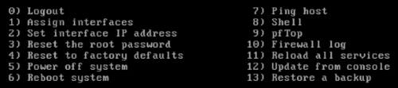
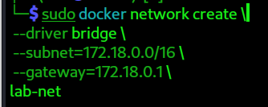
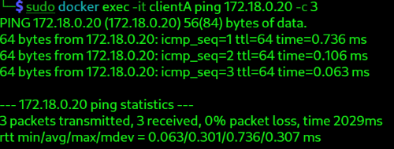
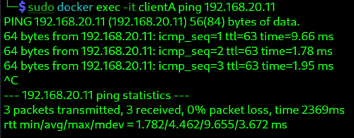
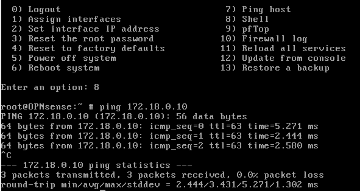

# 01_network_setup_lab.md
## Objective / 目的

- Understand how to build a basic internal network environment from scratch.   
- Practice IP address assignment and basic connectivity testing.
- Prepare a foundation for VLAN and routing exercises in the next labs.  
- ゼロから社内ネットワーク環境を構築する方法を理解します。 
- IPアドレスの割り当て、接続確認の手順を練習します。  
- 次のVLAN設計・ルーティング演習の基礎を整えます。

## Scenario / シナリオ

- The company is opening a new office site.
- IT team needs to validate the internal LAN/WAN routing configuration and the security of internet connectivity, before deploying actual network equipment.
- Set up the virtual machine to simulate the configuration using pfSense in a virtual environment.
- 会社は新しい拠点を開設する予定です。
- ITチームは、本番環境へのネットワーク機器導入に先立ち、LAN/WANのルーティング構成とインターネット接続の安全性を検証する必要があります。
- OPNsenseを使用し、仮想環境内で構成をシミュレーションできるよう設定します。

## Environment / 環境

- OS : Linux
- Virtual Machine : VirtualBox
- Router : OPNsense VM
- Container : Docker
	- ClientA : PostgresSQL
	- ClientB : Alpine OS

## Overview / 概要

- Create two host PCs and one router in virtual environment as following, and test connectivity between them / ２つの社内ホストPCと１つのルーターを仮想環境に作成し、通信テストを行う

- Created Components / 構成要素
	- OPNsense VM (Router / 社内ルーター)
	- ClientA (PC1 / 社内PC A) - Docker container
	- ClientB (PC2 / 社内PC B)  - Docker container

- Connectivity Tests / 通信テスト
	- ClientA ↔ ClientB  
	    クライアント A と クライアント B の相互通信確認
	- ClientA ↔ OPNsenseVM 
	    クライアント A とルーターの通信確認

## Steps Overview / 手順まとめ
1.  Design Network Architecture / ネットワーク構成を設計
2. Configure OPNsenseVM Router / OPNsenseVM ルーターを作成
3. Create Client A and B / クライアントAとBを作る
4. Connectivity Test / 通信テスト

--- 
## Steps / 手順
### 1.  Design Network Architecture / ネットワーク構成を設計
- Design a secure structure to perform connection test in demo environment. / 通信テストをセキュアなデモ環境で行えるようデザインする
- Assign network interfaces as follows. / ネットワークインターフェースは次のように設定する

```text
 └── VirtualBox (VM NAT router: 10.0.3.2)
       │ 
       ├── Kali Linux (Bridged: 192.168.10.109)
       │       │      (Internal Network:192.168.20.10)
       │       │  
       │       ├── Docker (default: 172.17.0.1/16)
       │       └── docker network (172.18.0.1/16)
       │                  ├── clientA  （172.18.0.10/16）
       │                  └── clientB （172.18.0.20/16）
       │
       └── OPNsense VM
             ├── Adapter1: Internal Network (LAN: 192.168.20.11/24)
             └── Adapter2: NAT  + Port Forwarding (WAN: 10.0.3.10/24)
```
---

### 2. Configure OPNsenseVM / OPNsenseVMの設定

####  2-1. Install OPNsense / OPNsenseをインストール

1. Download and unzip OPNsense ISO file  / OPNsense ISOをダウンロードし解凍しておく
    - Go to [https://opnsense.org/download/](https://opnsense.org/download/) → Select Architecture: AMD64, Image Type: DVD ISO, Interface: VirtualBox 
    / [https://opnsense.org/download/](https://opnsense.org/download/) にアクセス → アーキテクチャ: AMD64、イメージタイプ: DVD ISO、仮想環境用: VirtualBoxを選択

2. Create a new VirtualBox VM / VirtualBoxに新規VMを作成
    - On VirtualBox Manager, click New from top buttons / バーチャルボックスマネージャーにて、Newボタンをクリック
    - Recommended configurations/実用的な設定例:
	    - Name: `OPNsense` / 名前
	    - Type/タイプ: BSD → FreeBSD (64-bit) 
	    - Memory/ メモリ: >2048 MB 
	    - Virtual Disk Storage / ディスク容量 :(>8 GB) 
	- Demo configurations /デモの設定:
		- Memory / メモリ: 2516MB
		- Processors/プロセサー: 1GB
	    - Disk Size / ディスクサイズ: 10GB 

3. Attach ISO / ISOをマウント
    - Download ISO image from official in advance. Unzip the image, and use ISO file.

4. Start OPNsense / OPNsenseを起動

5. Install ISO onto VDI / ISOをVDIにマウント
	- Once "login" appears, enter default value
		- login : installer
		- password : opnsense
	- Proceed to set-up, or full installation guide reference is here https://youtu.be/naYU8UR5BhQ?si=toKrrLfoZqT8TBaz
	- DO NOT forget removing ISO and keep it as "empty", before rebooting. / 再起動の前にISOをemptyにしておくことを忘れずに
    - Once "login" appears on black screen, enter default value / login画面に戻ったらデフォルトのルートでログイン
	    - login : root
	    - password : opnsense
    - Select option number for reboot or your choice.

#### 2-2. Network Settings on VirtualBox / VirtualBox側のOPNsenseネットワーク設定
- Select OPNsense VM > settings > Network
/ OPNsense VMを選択→設定→ネットワークをクリックして以下を設定
	- Adaptor 1 :
		- Attached to : Internal Network / lab-net
		- Mac : 080027AABBCC
	- Adaptor 2 :
		- Attached to : NAT + portfowarding
		- Mac : 080027AABBDD
		- Advanced Settings > Portforwarding:

| Name/名前       | Protocol/プロトコル | HostIP/ホストIP | HostPort/ホストポート | GuestIP/ゲストIP | GuestPort/ゲストポート |
| ------------- | -------------- | ------------ | --------------- | ------------- | ---------------- |
| OPN-GUI-HTTPS | TCP            | 127.0.0.1    | 8443            | 10.0.3.10     | 443              |

#### 2-3. OPNsense interfaces / OPNsense側でインターフェースの設定
- Run OPNsense VM / OPNsense VMを起動
- Login and access OPNsense menu (options appear on the VM screen) / OPNsenseコンソールメニューにアクセス（VM画面にオプション表示)

 <br>

- Select Option 1 ) Assign Interfaces, and set as:
	- LAN : em0 
	- WAN : em1 
- Select Option 2) Set interface IP address
	- LAN em0 
		- static IP `192.168.20.11/24`
	- WAN em1 
		- static IP `10.0.3.10/24` 
	- all N for IPv6 settings
	- to HTTP? : N
	- web GUI certificate? : y
	- restore GUI? : y
- To access GUI console from Windows host OS, you need to modify firewall and NAT + port forwarding, but skip its instruction in this file. / GUIコンソールにアクセスするためにはファイアウォールとNAT + port forwardingの設定が必要ですが、このファイルでは飛ばします 
- After finishing the settings of network and firewall, you can access GUI console from your Windows host / すべての設定が終わると、Windowsホストのブラウザからアクセス可能になります
	- `https://127.0.0.1:8443`

##### References
- You can also check ->
- OPNsense Get Started by OPNsense : https://opnsense.org/get-started/#:~:text=The%20WAN%20port%20will%20have,keep%20on%20improving%20the%20project
- How To Install OPNsense on VirtualBox – Step by Step Guide by ZacksTech: 
- https://youtu.be/naYU8UR5BhQ?si=D1IxJqtsSuU9vnAo

#### 2-4. Verify Interfaces / インターフェース確認

1. Select Option 8) shell/ コンソールシェル（Option 8）にアクセス
2. Run: `ifconfig`/ を実行
3. Expected output / 期待される表示:
    - em0: LAN → IPv4 192.168.10.50/24
    - em1: WAN → IPv4 10.0.3.10/24
	- NOTE: subnet 0xffffff00 indicates 255.255.255.0 (/24)

---
### 3. Create Client A and B / クライアントAとBを作る

#### 3-1. Install Docker (for Client A&B) / Dockerをインストールする
- Installing docker from Kali Linux repository, to keep compatibility with my kali OS for this demo. / デモ用にKali LinuxからOSをインストールしています。

```console
sudo apt update
sudo apt install -y docker.io
sudo systemctl enable --now docker
sudo usermod -aG docker $USER
```

 - To check groups that username belongs
 ```console
groups $USERNAME
 ```
 - To check usernames in the docker group
```console
getent group docker
```

#### 3-2. Create Docker Network on Linux host/ DockerネットワークをLinuxホスト上で作成

1. Create a custom bridge network matching OPNsense LAN / OPNsense LANと通信できるよう設定
```console
sudo docker network create \
  --driver bridge \
  --subnet=172.18.0.0/16 \
  --gateway=172.18.0.1 \
  lab-net
```


2. Confirm the subnet and gateway is created / サブネットとGWの確認
```console
sudo docker network ls

# or for detail output
sudo docker network inspect lab-net
```
---
#### 3-3. Run Docker Container on Linux / Linux上でDockerコンテナを起動

##### 1. First, check docker is installed / dockerがインストールされているか確認
```console
docker --version
```
##### 2. ClientA (PostgreSQL for DB)
- Creating a DB server.
- For later use, choose PostgreSQL official image (having a minimum scanning tools such as )/ 
	-  `--memory="512m"` → limit memory to prevent OOM /メモリ上限（OOM防止）
	- `--cpus="1.0"` → limit CPU / CPU使用率制限
	- `-e POSTGRES_PASSWORD=user123` → set initial password / 初期パスワード設定
	- Using a `postgres`  official image for light weight Debian-base / 公式イメージ（Debianベースで軽量）
```console
  sudo docker run -dit \
  --name clientA \
  --network lab-net \
  --ip 172.18.0.10 \
  --memory="512m" \
  --cpus="1.0" \
  -e POSTGRES_PASSWORD=user123 \
  -v ~/Desktop/Demo/Docker/clientA/logs:/var/lib/postgresql/logs
  postgres
  
```
- For back-ups, a named volume with --mount is recommended, but in this demo, I use a bind mount with -v for convinience. / バックアップは名前付きボリュームが推奨されていますが、このデモでは便宜上バインドマウントを使用しています

- You can also check -> Docker の Volume がよくわからないから調べた https://qiita.com/aki_55p/items/63c47214cab7bcb027e0#--mount-%E3%82%AA%E3%83%97%E3%82%B7%E3%83%A7%E3%83%B3

- Confirm if ClinetA is up / コンテナを確認
```console
sudo docker ps -a

# If still Exited, it may be an error /Exitedなら起動エラーの可能性
# Try to re-start a container / コンテナを起動してみる
sudo docker start clinetA
```

- Verify DB / 動作確認
```console
sudo docker exec -it clientA psql -U postgres
exit
```

##### 3. ClientB (Alpine for monitoring)
- Creating a monitoring container. / 監視コンテナを作ります。

- First, create a clientB folder on Kali host/ホストにclientBフォルダを制作します。
```console

mkdir clientB
cd clientB
```

- Within clientB folder, create a monitoring script. / clientB フォルダに、監視実行ファイルを作ります
```console
nano monitor.sh
```
- Write a script / 実行スクリプトを書きます
	- Minimum monitoring for demo use:
	- Loop runs 3 times, checking connectivity every 60 seconds. / ループは3回実行され、60秒ごとに接続確認を行います。
	- Logs only when ping fails, with timestamp in `YYYY-MM-DD HH:MM:SS` format. / ping に失敗した場合のみ、`YYYY-MM-DD HH:MM:SS` 形式でログを記録します。
	- Final message logs completion after all checks. / 最後に、すべてのチェックが完了したことをログに記録します。
```console
#!/bin/sh
logfile="/var/log/monitor.log"
mkdir -p "$(dirname "$logfile")"

count=0
max=3

while [ $count -lt $max ]; do
    if ! ping -c 1 8.8.8.8 -W 2 > /dev/null 2>&1; then
        echo "$(date '+%F %T') - ping failed" >> /var/log/monitor.log
    fi
    count=$((count + 1))
    sleep 60
done

echo "$(date '+%F %T') - monitoring finished after $max checks" >> /var/log/monitor.log
```
- Save and close the file. / 保存して閉じる
	- Ctrl+O → Enter → Ctrl+X

- Within clientB folder, create a Docker image. / clientB フォルダに、Dockerファイルを作ります
```console
nano Dockerfile
```
- Write a script . / スクリプトを書きます。
	- For later use, choose an light weight AlpineOS. / 後の作業のため、軽量のApline OSを使用します。
```dockerfile

FROM alpine
RUN apk add --no-cache python3 curl iputils busybox-extras

#  監視スクリプトをコピーして実行権限を付与
# （1分ごとにping、異常時のみログ出力）
COPY monitor.sh /usr/local/bin/monitor.sh
RUN chmod +x /usr/local/bin/monitor.sh

# コンテナ起動時にスクリプトを実行
CMD ["sh", "-c", "/usr/local/bin/monitor.sh"]

```

- Script Breakdown / 説明
  - In Alpine, `/usr/local/bin` is included in the default `$PATH`, so the script can be executed directly.
    / Alpineでは `/usr/local/bin` はデフォルトの `$PATH` に含まれているため、スクリプトは直接実行可能。
  - Copy `monitor.sh` from host to `/usr/local/bin/monitor.sh` inside the container.
    / ホストからコンテナ内の `/usr/local/bin/monitor.sh` に `monitor.sh` をコピーする。
  - At container startup, execute `/usr/local/bin/monitor.sh` via `sh -c`.
   / コンテナ起動時に `/usr/local/bin/monitor.sh` を `sh -c` 経由で実行する。
  - Using `sh -c` allows safe execution of scripts that include complex commands, pipes, or conditionals.
   / `sh -c` を使うことで、複雑なコマンドやパイプ、条件分岐などを含むスクリプトも安全に実行できる。
  - `--no-cache` ... installs packages without storing cache, keeping the image lightweight.
    /キャッシュを残さずにインストール（イメージを軽く保つ）
  - `python3 curl iputils busybox-extras` ... tools are added to provide essential tools for scripting, networking, and diagnostics.
    /スクリプト実行・ネットワーク操作・診断に必要な基本ツールとして追加
  - No spaces are needed before or after the square brackets `[]` for this JSON format.
    / JSON配列なので `[]` の前後にスペースは不要です。

- Build an image / イメージをビルド
	- sudo docker build -t clientb-monitor .
		- Image names: lowercase only /イメージ名：小文字のみ
		- If you want to use a different file (e.g., `Dockerfile.dev`), you need to specify it using the `-f` option: 他のファイル（例：`Dockerfile.dev`）を使いたい場合は、`-f` オプションで指定する必要があります：
		- sudo docker build -f Dockerfile.dev -t clientB-dev .

- Launch a ClientB container / コンテナを起動
```console
sudo docker run -dit \
 --name clientB \
 --network lab-net \
 --ip 172.18.0.20 \
 --memory="512m" \
 --cpus="1.0" \
  -v ~/Desktop/Demo/Docker/clientB/logs:/var/log/clientB \
clientb-monitor
```

- Confirm if ClinetB is up / コンテナを確認
	- sudo docker ps -a
	- `Exited` なら起動エラーの可能性
	- Try to restart a container / コンテナを起動してみる
	- sudo docker start clientB

- Confirm log file / 
	- sudo docker exec -it clientB cat /var/log/monitor.log
##### 4. Install Utilities on ClientA PosgreSQL
- Install network utilities on ClientA / ClientAにネットワークツールをインストールする
	- It has only PosgreSQL functions for mostpart. /これは主に PostgreSQL の機能しか備えていません。
	- To use scanning commands such as ip and ping, install iproute2(ip) and iputils-ping(ping)./ ip や ping などのスキャン系コマンドを使うには、iproute2(ip)と iputils-ping(ping)をインストールします。

- Enter the shell / シェルに入る
`sudo docker exec -it clientA bash`

- Install utilities /インストール
`apt update`
`apt install -y iproute2 iputils-ping`

##### 5. Test Connectivity for Clinet A & B/ クライアントA&Bの接続テスト

- Verify IPs:
```console
# Make sure two containers are up./コンテナどちらも起動させてから
sudo docker exec -it clientA ip a
sudo docker exec -it clientB ip a
```

- Test connectivity / 接続テスト
```console
sudo docker exec -it clientA ping 172.18.0.20 -c 3

# Alpine does't support -c
sudo docker exec -it clientB ping 172.18.0.10
```


---

##### 6. Verify Route Table / ルートテーブル確認

1. From Client A:
```console
sudo docker exec -it clientA ip route
```

2. Expected output:
```console
default via 192.168.10.1 dev eth0 192.168.10.0/24 dev eth0 proto kernel scope link src 192.168.10.10
```

---

### 4. Connectivity Test / 通信テスト
| Path / テスト内容           | Test / 通信経路                                  | Description / 説明                                          | Result / 結果 |
| ---------------------- | -------------------------------------------- | --------------------------------------------------------- | ----------- |
| **ClientA → ClientB**  | `docker exec -it ClientA ping 172.18.0.20`   | Host-to-host connectivity test / クライアント間の疎通確認             | **PASS**    |
| **ClientB → ClientA**  | `docker exec -it ClientB ping 172.18.0.10`   | Host-to-host reverse connectivity test / クライアント間の逆方向疎通確認  | **PASS**    |
| **ClientA → OPNsense** | `docker exec -it ClientA ping 192.168.20.11` | Reachability test from client to router / クライアント→ルーター疎通確認 | **PASS**    |
| **OPNsense → ClientA** | `ping 172.18.0.10`（OPNsense シェル上）            | Router-to-client connectivity / ルーター→クライアント疎通確認           | **PASS**    |

- ClientA → OPNsense

 <br>

- OPNsense → ClientA

 <br>

---
## References
- You can also check ->
	- メモリ、CPU、GPU に対する実行時オプション by Docker-docs-ja https://docs.docker.jp/config/containers/resource_constraints.html
	- Docker、ボリューム(Volume)について真面目に調べた by [@gounx2(gounx2)](https://qiita.com/gounx2)  https://qiita.com/gounx2/items/23b0dc8b8b95cc629f32
	- Docker マウント(データの永続化) by NETASSIST https://www.netassist.ne.jp/techblog/24940/
	- Dockerのファイアウォール設定(ufwとiptables) - DOCKER-USER by @ohhara_shiojiri https://qiita.com/ohhara_shiojiri/items/e08076009cd3098a9deb
	- Dockerの内部ネットワーク構造を紐解いてみる by @maplejava https://qiita.com/maplejava/items/a70ef1a4e62b73085aa1
