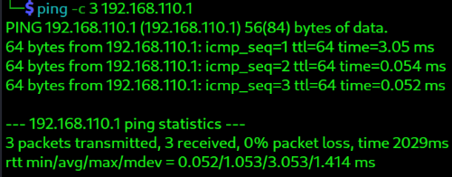
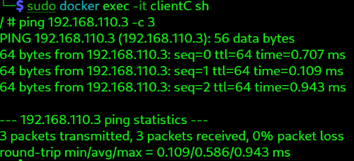
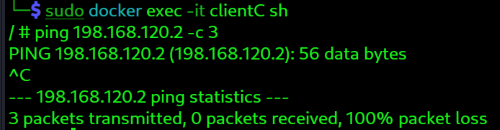

# 02_vlan_design_example.md

## Objective / 目的
- Understand the structure and concept of VLANs
- Design network segmentation for each department
- Simulate VLAN configurations in a virtual lab environment
- VLANの基本構造と概念を理解する
- 部署ごとのネットワーク分離を設計する
- 仮想環境（VirtualBoxなど）でVLANをシミュレーションする
- この構成により、Kali上で複数VLANを再現し、Dockerコンテナを使って部門別ネットワークの通信・隔離・ルーティング演習が可能です。  
- 母艦PCや外部ネットワークには影響せず、安全に演習できます。
## Scenario / シナリオ
- IT team is notified that there are the Sales, Development, and Admin departments, and each have different communication requirements. 
- To ensure secure and efficient connectivity, you need to design and configure VLANs.
- 営業部門・開発部門・管理部門はそれぞれ異なる通信要件を持っているようです。
- セキュリティ分離と効率的な通信のために、VLAN を設計・設定します。
## Lab Steps / 演習ステップ
- Create dummy interfaces on Kali, and attach Docker containers to isolated networks for VLAN-like simulation.
- Kali上で dummy インターフェースを作り、Dockerコンテナを隔離ネットワークに接続して VLAN 的な演習を行います。

---
### VLAN Design / VLAN設計

| 部署 / Department  | VLAN ID | IP Range      | Subnet Mask   | 目的 / Purpose                      |
| ---------------- | ------- | ------------- | ------------- | --------------------------------- |
| Sales (営業)       | 30      | 192.168.110.0 | 255.255.255.0 | External communications / 社外通信メイン |
| Development (開発) | 40      | 192.168.120.0 | 255.255.255.0 | Development use / 開発環境・Git等       |
| Admin (管理)       | 50      | 192.168.130.0 | 255.255.255.0 | Internal admin systems / 経理・社内管理  |

---
### Network Architecture / ネットワーク構成
- Topology for this demo using dummy interfaces / このデモで使用する dummy interface による構成:
-  Each VLAN is isolated by its dummy interface and Docker bridge network. / 各VLANは dummy interface + Docker bridge によって隔離されています。
- These interfaces are temporary and will disappear on reboot. / dummyの設定は一次的なので再起動すると消えてしまうので注意です。

```txt
Kali Linux (Router)
│
├── dummy30 (192.168.110.1/24) 
│       └── Docker bridge: vlan30-net
│               ├── ClientC (192.168.110.2)
│               └── ClientD (192.168.110.3)
│
├── dummy40 (192.168.120.1/24) 
│       └── Docker bridge: vlan40-net
│               ├── ClientE (192.168.120.2)
│               └── ClientF (192.168.120.3)
│
└── dummy50 (192.168.130.1/24)
        └── Docker bridge: vlan50-net
                ├── ClientG (192.168.130.2)
                └── ClientH (192.168.130.3)
		
```

---
### 1. Create Dummy Interfaces on Kali / Kali上で dummy interface 作成

```console
# Create dummy interfaces / dummyインターフェース作成

# dummy30
# Docker ネットワークと衝突しないIP
sudo ip link add dummy30 type dummy
sudo ip addr add 192.168.110.254/24 dev dummy30
sudo ip link set dummy30 up

# dummy40
sudo ip link add dummy40 type dummy
sudo ip addr add 192.168.120.254/24 dev dummy40
sudo ip link set dummy40 up

# dummy50
sudo ip link add dummy50 type dummy
sudo ip addr add 192.168.130.254/24 dev dummy50
sudo ip link set dummy50 up

# Delete interfaces if needed /
sudo ip link delete dummy30

# Confirm dummy interfaces / dummyインターフェース確認
ip addr show | grep dummy
```


### 2. Create Docker Bridge Networks / Dockerブリッジネットワーク作成

```console
# VLAN30 network
docker network create --driver bridge \
 --subnet=192.168.110.0/24 \
 --gateway=192.168.110.1 \
 vlan30-net

# VLAN40 network
docker network create --driver bridge \
 --subnet=192.168.120.0/24 \
 --gateway=192.168.120.1 \
 vlan40-net
 
 # VLAN50 network
docker network create --driver bridge \
 --subnet=192.168.130.0/24 \
 --gateway=192.168.130.1 \
 vlan50-net

# Confirm networks / ネットワーク確認  
docker network ls

# For detail / 詳細表示
docker network inspect vlan30-net
docker network inspect vlan40-net
```


### 3. Launch Clients / コンテナ起動

```console
# Client C → VLAN30
docker run -dit --name clientC --network vlan30-net alpine sh

# Client D → VLAN30
docker run -dit --name clientD --network vlan30-net alpine sh

# Client E → VLAN40
docker run -dit --name clientE --network vlan40-net alpine sh

# Client F → VLAN40
docker run -dit --name clientF --network vlan40-net alpine sh

# Client G → VLAN50
docker run -dit --name clientG --network vlan50-net alpine sh

# Client H → VLAN50
docker run -dit --name clientH --network vlan50-net alpine sh
```
- Alpine image is lightweight and sufficient for exercises / Alpine は軽量で演習に十分です


### 4. Verify Connectivity / 接続確認


#### Test host → container connectivity / ホスト→コンテナ接続確認
```console
ping -c 3 192.168.110.1
ping -c 3 192.168.120.1
```



#### Test container → container connectivity / コンテナ→コンテナ接続確認

- ClientC (VLAN30) -> ClientD (VLAN30) is successful / ClientC -> D は同じVLAN上で通信成功
```console
docker exec -it clientC ping 198.168.110.3
```



- ClientC (VLAN30) -> ClientE (VLAN40) is not successful, because ClientE is in different  VLAN / ClientC -> E は違うVLAN上で通信失敗
```console
docker exec -it clientC ping -c 3 192.168.120.2
 ```


---

### Troubleshooting / トラブルシューティング
- If ping didn't work / pingが上手くいかなかった場合

- Confirm dockers containers are running / コンテナが起動しているか確認
```console
docker ps -a
```

- Start dockers if they are exited / もしExitedしていたらコンテナを起動
```console
sudo docker start clientC

# start all exited docker at once
docker start $(docker ps -q -a -f status=exited)
```

- Check if interfaces are up / インターフェースがアップしているか確認
```console
ip link show
```

- Confirm IP address assigned to container / コンテナに割り当てられたIPを確認
```console
docker exec -it clientC ifconfig
```

- If IP address is assigned differently from first time, stop containers and re-start in the order you want to re-assign IP, as it uses DHCP /  DHCPで割り当てられているので、もしIPが変わっていたら、再割り当てしたい順番にコンテナを停止して再度起動させると戻る
```console
# Stop container
docker stop clientC

# Stop all containers at once
docker stop $(docker ps -aq)

# Start container
docker start clientC

# Start all containers at once
docker start $(docker ps -q -a -f status=exited)
```

