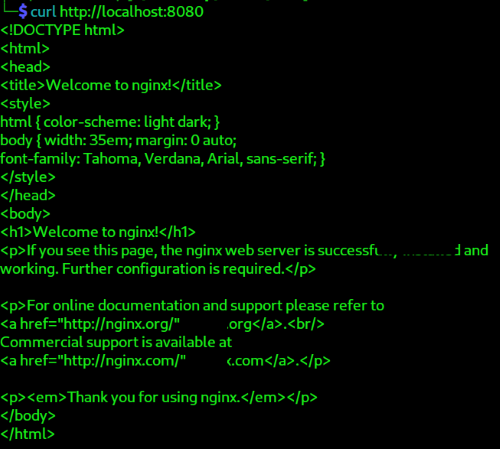
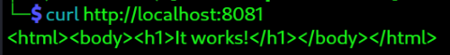

# 03_nginx_apache_docker_setup

## Objective / 目的

- To build isolated, resettable web-server environments using Docker to support safe testing for development teams.
- 開発チーム向けに、安全にテストできるよう Docker を用いて隔離されたリセット可能な Web サーバー環境を構築する。

## Scenario / シナリオ

- A new development team in your company needs a test web server.  
- Set up Docker-based web servers (Nginx and Apache) to provide an isolated, easy‑to‑reset environment.  
- This allows safe testing without modifying the base OS.
- 社内の新しい開発チームがテスト用ウェブサーバーを必要としています。  
- Docker 上に Nginx と Apache を構築し、容易に管理・破棄できる安全なテスト環境を提供します。  
- 既存ネットワークを汚さず、安全な環境を提供することが目的です。

## Environment / 環境
- OS : Linux
- DB : PostgreSQL on Docker
---

## Step 1: System Preparation / システム準備

- Docker Installation / Docker の導入（ホスト側のみ）
```console
# Docker インストール（Debian/Ubuntu 系）
curl -fsSL https://get.docker.com | sudo sh
sudo systemctl enable docker
sudo systemctl start docker

# Docker が動作するか確認
docker --version
```

- Confirm network connectivity / ネットワーク接続確認
```console
ping -c 4 google.com
```

---

## Step 2: Firewall Setup (Linux Host) / Linux側のファイアウォール設定

- Allow essential ports on Linux host. / 必要ポートのみ許可
- Open ports for external access to run Nginx and Apache in containers. /Nginxと Apache をコンテナで動かすため、外部アクセス用ポートを開放します。
```console
# Activate ufw / ufwを有効化
sudo ufw status verbose
sudo apt update
sudo apt install ufw
sudo ufw enable

# Configure ufw / ufwを設定
sudo ufw allow OpenSSH
sudo ufw allow 8080   # Nginx 用（例）
sudo ufw allow 8081   # Apache 用（例）
sudo ufw enable
sudo ufw status
```

---

## Step 3: Nginx Setup (Docker) / Nginx 構築（Docker）

- Start Nginx container / Nginx コンテナ起動
- The Nginx container starts and get accessible at `http://<server IP>:8080`. / Nginx コンテナが起動し、`http://<サーバーIP>:8080` でアクセスできます。
```console
docker run -d --name test-nginx -p 8080:80 nginx:latest
```

- Check status / 動作確認
- The setup is successful, if the default Nginx page appears when accessed via a browser./ブラウザでアクセスしてデフォルト Nginx ページが表示されれば成功です。
```console
docker ps -a
curl http://localhost:8080
```


- Create a dockerfile as needed to install curl/wget/vim as needed. / 必要に応じてcurl/wget/vim を Nginx コンテナ内に追加するDockerfile を作る

```console
# dockerfile
FROM nginx:latest
RUN apt update && apt install -y curl wget vim
```

---

## Step 4: Apache Setup (Docker) / Apache 構築（Docker版）

- Start Apache container / Apache コンテナ起動
- Access Apache Container at `http://<サーバーIP>:8081`  /Apache コンテナは `http://<サーバーIP>:8081` でアクセスできます。
```console
docker run -d --name test-apache -p 8081:80 httpd:latest
```

- Check status / 動作確認
- The setup is successful, if the default Apache page appears when accessed via a browser./ブラウザでアクセスしてデフォルト Apache ページが表示されれば成功です。
```console
ddocker ps
curl http://localhost:8081
```


---
## Step 5: Service Switching (Optional) / サービス切り替え（任意）

- Both Nginx and Apache can run simultaneously when using different ports. /Nginx と Apache はポートが違えば同時に稼働できます。  
- If you need to change ports, start over by recreating the container./ポート変更が必要な場合はコンテナを作り直す必要があります。


- Example: To change Apache to use port 8082 /例：Apache を 8082 へ変更する場合
```console
docker stop test-apache
docker rm test-apache

docker run -d --name test-apache -p 8082:80 httpd:latest
```

---

## Step 6: Maintenance and Security / 保守とセキュリティ

- Update host OS / OS 側のパッケージ更新
```console
sudo apt update && sudo apt upgrade -y
```

- Restart containers if needed / コンテナ再起動

```console
docker restart test-nginx
docker restart test-apache
```

- Check container logs / コンテナログ確認
```console
docker logs test-nginx
docker logs test-apache
```

- Docker はサービスを OS と分離できるため、誤設定リスクが低く、安全に学習できます。

---

## Completion / 完了条件

- Nginx and Apache Docker containers are running/ Nginx と Apache の Docker コンテナが稼働している
- Accessible from a browser via :8080 and :8081 / ブラウザから :8080 / :8081 でアクセスできる
- Unnecessary ports are closed by UFW / UFW により不要ポートが閉じている
- The operating system is up to date /OS 側が最新の状態になっている
